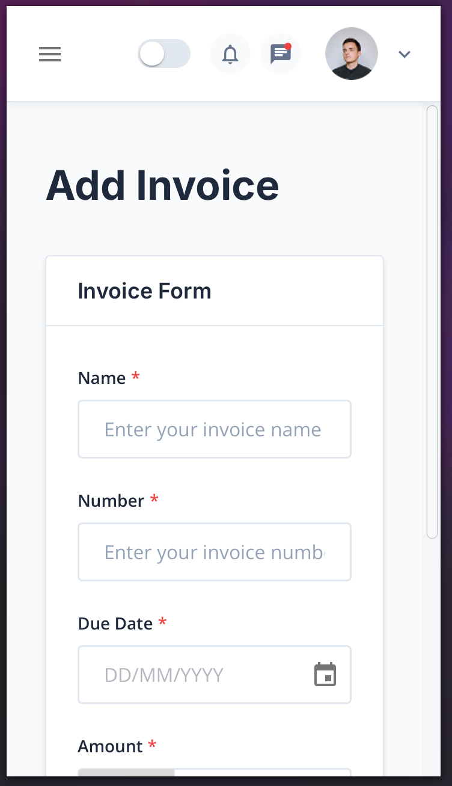

# Invoice Management App

A modern invoice management application built with Next.js, Material-UI, and TypeScript. This application helps you create, manage, and track invoices efficiently.

## Features

- Create and manage invoices
- Modern and responsive UI with Material-UI
- Form validation with React Hook Form and Zod
- Built with TypeScript for type safety

## Live Demo & Screenshots

🌐 **Live Demo**: [Invoice Hub](https://invoice-hub-mu.vercel.app)

### Screenshots

#### Dashboard & Invoice List


- Clean and intuitive interface
- Quick status filtering
- Search functionality
- Responsive design

#### Create Invoice


- User-friendly form
- Real-time validation
- Date picker integration
- Currency formatting

#### Mobile View



- Fully responsive design
- Optimized for mobile devices
- Easy navigation

## Technical Decisions

### Project Structure

The project follows a feature-first organization pattern where related code is grouped by feature rather than type. This makes the codebase more maintainable and scalable.

### Component Organization

```
src/components/invoices/
├── InvoiceForm.tsx           # Main component
├── types/                    # Types specific to invoice components
│   └── index.d.ts
├── styles/                   # Styles specific to invoice components
│   ├── InvoiceForm.styles.ts
│   └── InvoiceList.styles.ts
└── subcomponents/           # Smaller components used by main components
```

### Styling Strategy

- Each component has its own `.styles.ts` file located next to the component or in a `styles` folder if there are multiple style files
- Styles are colocated with their components for better maintainability
- Complex components with multiple style files have their own `styles` directory
- Using Emotion styled-components with Material-UI for consistent theming

### Type Definitions

- Types are organized based on component scope:
  - Shared types are in `src/types`
  - Feature-specific types are in their respective feature directories
  - Component-specific types are either in the component file or in a `types` directory if complex
- This organization ensures type definitions are as close as possible to where they're used

### State Management

- Using React's built-in useState for component-level state
- URL parameters for search and filter state
- Local storage for data persistence
- This approach keeps the app simple and avoids over-engineering

## Prerequisites

Before you begin, ensure you have the following installed:

- Node.js (version 18 or higher)
- pnpm (recommended) or npm
- Git

## Setup Instructions

1. Clone the repository

```bash
git clone https://github.com/yourusername/invoice-hub.git
cd invoice-hub
```

2. Install dependencies

```bash
pnpm install
# or if using npm
npm install
```

3. Start the development server

```bash
pnpm dev
# or if using npm
npm run dev
```

4. Open your browser and navigate to `http://localhost:3000`

## Available Scripts

- `pnpm dev` - Starts the development server
- `pnpm build` - Creates a production build
- `pnpm start` - Starts the production server
- `pnpm lint` - Runs ESLint for code linting

## Tech Stack

- Next.js 14
- React 18
- Material-UI
- TypeScript
- React Hook Form
- Zod for validation
- Emotion for styled components

## Project Structure

```
src/
├── app/              # Next.js app router pages
├── components/       # Reusable components
├── constants/        # Constants and configuration
├── layouts/          # Layout components
├── utils/           # Utility functions
└── styles/          # Global styles and themes
```

## Contributing

1. Fork the repository
2. Create your feature branch (`git checkout -b feature/amazing-feature`)
3. Commit your changes (`git commit -m 'Add some amazing feature'`)
4. Push to the branch (`git push origin feature/amazing-feature`)
5. Open a Pull Request

## License

This project is licensed under the MIT License.
